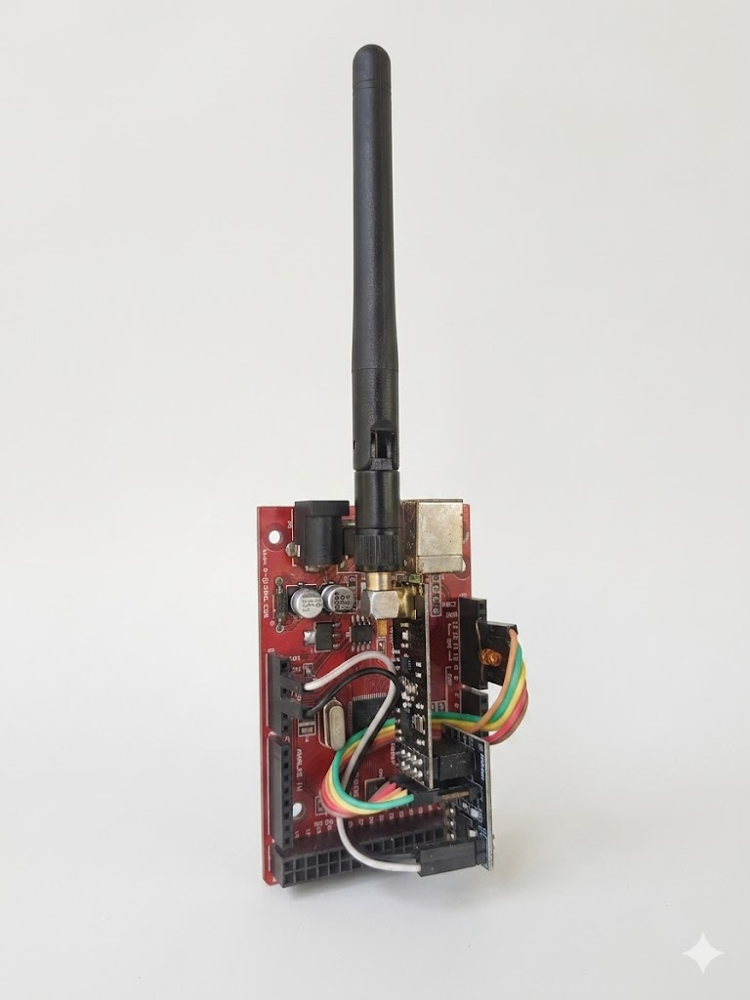

# Jx (Jammer Experimental)

  
   
  <i>Experimental 2.4GHz physical-layer research tool for analyzing SNR and signal resilience.</i>

## **Project Overview**
**Jx** is a research-oriented project designed to analyze **Physical Layer** vulnerabilities within the 2.4GHz ISM band. This tool focuses on how high-density radio frequency interference affects **Clear Channel Assessment (CCA)** and **Signal-to-Noise Ratio (SNR)** in standard 802.11 b/g/n networks.

---

## **Hardware Configuration**
The prototype is built on the **Gizduino X** platform, utilizing an **nRF24L01+ (PA+LNA)** module for high-gain transmission.

### **Pin Mapping**
Based on the implementation in `Jx.ino` and the hardware setup shown above:

| nRF24L01 Pin | MCU Pin | Function |
| :--- | :--- | :--- |
| **CE** | 9 | Chip Enable |
| **CSN** | 10 | SPI Chip Select |
| **SCK** | 13 | SPI Clock |
| **MOSI** | 11 | SPI Data In |
| **MISO** | 12 | SPI Data Out |

### **Power Management**
The **PA+LNA** version requires a stable power source due to peak current consumption, reaching up to 115mA. A decoupling capacitor is recommended across the VCC/GND of the radio module to prevent voltage ripples during high-frequency hopping.

---

## **Technical Breakdown**
The firmware targets critical Wi-Fi center frequencies (Channels 1, 6, and 11) to test physical-layer resilience. 

### **Operational Logic**
*   **Manual Frequency Toggling**: The system switches between target channels by triggering a hardware restart. **Pushing the reset button on the microcontroller board** cycles the firmware to the next defined frequency.
*   **Visual Indicators**: Upon reset, the onboard LED provides feedback on the active channel:
    *   **1 Blink**: Channel 1
    *   **2 Blinks**: Channel 6
    *   **3 Blinks**: Channel 11
*   **Frequency Calculation**: The operating frequency $F$ is determined by the channel register value:

$$F = 2400 + \text{channel register}$$

| Target | Register Value | Center Frequency |
| :--- | :--- | :--- |
| **Wi-Fi Channel 1** | 12 | 2412 MHz |
| **Wi-Fi Channel 6** | 37 | 2437 MHz |
| **Wi-Fi Channel 11** | 62 | 2462 MHz |

---

## **Research Context**
This tool was developed to simulate physical-layer Denial of Service (DoS) conditions. It is specifically designed to analyze the impact of high-output interference when positioned in close proximity to target routing hardware. This allows for the testing of frequency-hopping spread spectrum (FHSS) mitigations and the robustness of embedded nodes against localized interference.

---

## **Legal & Ethical Disclaimer**
> **NOTICE**: This repository is for **educational and research purposes only**. 
> * All experiments were conducted within a controlled, shielded laboratory environment.
> * The author does not condone the unauthorized disruption of licensed communication networks.
> * Compliance with local telecommunications regulations is the sole responsibility of the user.

---

## **License**
This project is released under the **MIT License**.
